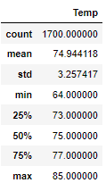
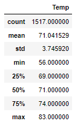

# Surfs_Up

## Overview of the Analysis
The purpose of this analysis is to provide weather data (temperature and precipitation) based on time on year for a specific location on Oahu, HI. This data will be utilized to identify whether the weather is conducive to open a profitable surf and ice cream shop.

This specific analysis examined June and December temperature statistics.

## Results
A snip of the results of this analysis are listed below. 

June Temperature Statistics: 

December Temperature Statistics: 

A few things of note between these two sets of data are: 
- The difference between the median temperature in June and December is only 4 degrees Fahrenheit, 75 degrees and 71 degrees respectively.
- The spread of the data is also remarkably similar and relatively minor with the interquartile range being 4 degrees for June and 5 degrees for December. 
- Standard deviation is an important statistic in look at the spread of the data. With the standard deviation being 3.26 and 3.75 for June and December, respectively, it can be concluded that the lowest of temperatures in Oahu, HI in our sample do not typically dip below 65.2 degrees in June and 59.8 degrees in December (3 standard deviations from the mean).

## Summary
Based on the results above, Oahu's climate would be a place where an ice cream and surf shop could thrive year round. The climate has both mild summers and winters with very few, if any, days of bitter cold. 

The following further queries would support making an even more informed decision on the viability of an ice cream and surf shop:
- A query investigating precipitation per month: It is possible that Oahu has a rainy season which would impact consumer behavior. Investigating precipitation per month would help anticipate a low season for the ice cream and surf shop. 
- A query investigating precipitation or temperature per year: It would be helpful to know if there are outliers by year that may be skewing the data. For example, a particularly rainy season or year may make the data look different and knowing how there might be changes year to year could help with long term planning. 
